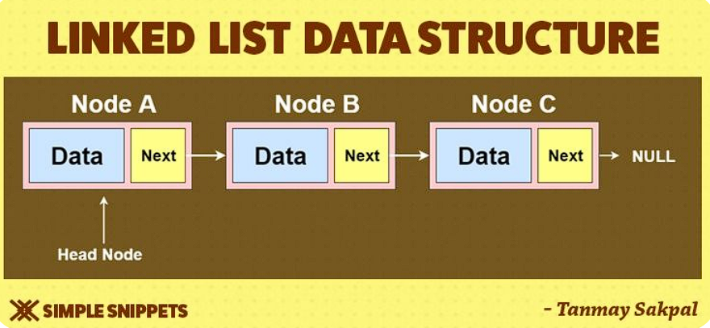
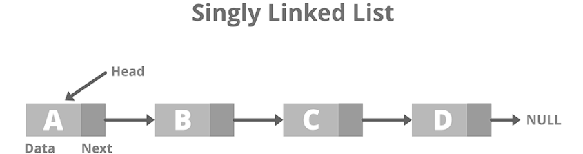

# Notes

## Linked List
A linked list is a type of data structure in which elements are connected to each other through links or pointers. Each element (called a node) has two parts - the data and a link pointing to the next node.

[Reference](https://www.masaischool.com/blog/linked-list/)

Operations: 
**Insertion:** To add/insert a new node to the list. 
**Deletion:** o remove ane existing node from the list. 
**Traversal:** To access each element of the linked list. 
**Search:** To find a node in the list. 
**Sort** - To sort the nodes.

## Singly linked list
It is the most commonly used linked list containing two parts- the data field, and the reference pointer to the next element.

It is the most basic linked list, with each node containing some data and a reference to the subsequent node of the same data type.

In a singly linked list, only forward traversal is possible; as it has only one pointer that points to the next node. For the same reason, it is also termed a ‘one-way chain’.

## Doubly linked list
A doubly linked list contains two pointers- one pointing forward and the other one pointing back to the previous node.

A doubly linked list, also known as a two-way linked list, is an advanced version of linked list that carries a pointer to both the following and earlier nodes in the chain.
